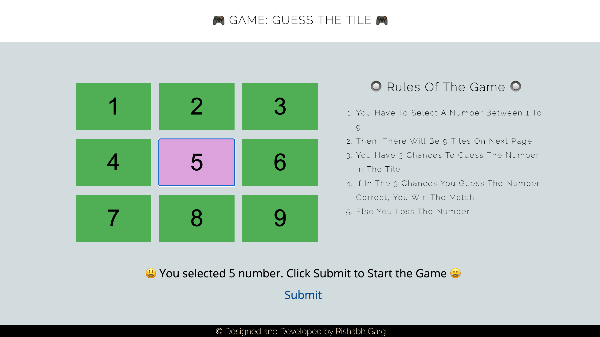
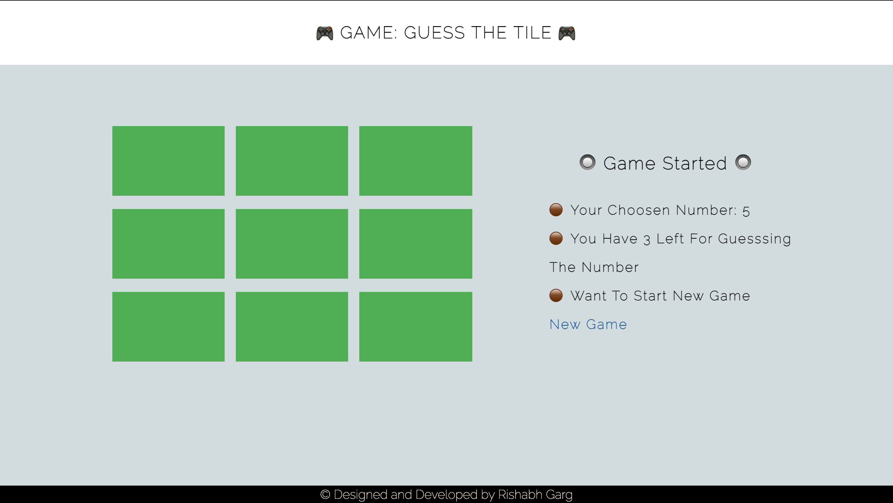

# Guess The Tile :clipboard:
It is an online game which is based on ReactJS. In this game, first you have to select a number and then from given tiles, you have to guess your number. If you guess correctly, you win else you will loss. 

Tools/Technologies: ReactJS, HTML, CSS, Javascript.


## Steps to Run Locally :scroll:
```sh
1. Clone this repository
2. Open the terminal where this repository is downloaded.
3. Make sure you have javascript compiler and npm installed in your system.
4. Now run this command npm install
5. Run command npm start
6. Open the browser with this link http://localhost:3000/
```

## Screenshots :crown:
Desktop View             |  Mobile View
:-------------------------:|:-------------------------:
  |  


## Help Contributing Guides :bangbang:

I love to have different `issues` and `pull request` for the betterment of this project.

Please discuss it with me first, before creating any pull request [new-issue](https://github.com/rishabhgarg25699/Guess-The-Tile/issues/new).

:tada: :confetti_ball: :smiley: _**Happy Contributing**_ :smiley: :confetti_ball: :tada:

## Contact With Me :busts_in_silhouette:

Email: rishabhgarg25699@gmail.com
Phono No: 7302383783
